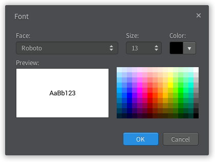
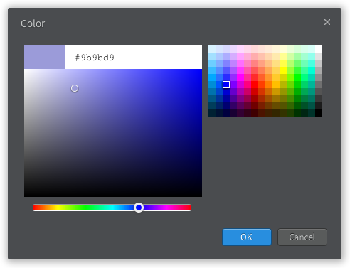
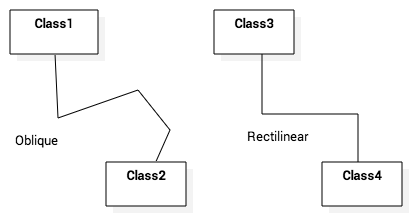

=============================
Editing Elements and Diagrams
=============================

.. contents::

Editing Diagrams
================

Create Diagram
--------------

To create a Diagram:

1. Select first an element where a new Diagram to be contained as a child in **Explorer**.
2. Select **Model | Add Diagram | <DiagramType>** in Menu Bar or select **Add Diagram | <DiagramType>** in Context Menu.

Delete Diagram
--------------

To delete a Diagram:

1. Select a Diagram to delete in **Explorer**.
2. Press :kbd:`Ctrl+Delete` or select **Edit | Delete from Model** in Menu Bar or **Delete from Model** in Context Menu.

Open Diagram
------------

To open a diagram, double-click a diagram in **Explorer**.

Close Diagram
-------------

To close a diagram, click the close icon (``x`` mark) of a diagram in **Working Diagrams** or press :kbd:`F4` or select **View | Close Diagram** in Menu Bar.

To close other diagram except a active diagram, press :kbd:`Ctrl+F4` or select **View | Close Other Diagrams** in Menu Bar.

To close all diagrams, press :kbd:`Shift+F4` or select **View | Close All Diagrams** in Menu Bar.

Change Active Diagram
---------------------

To change active diagram, select a diagram in **Working Diagram**.

To activate the next diagram, press :kbd:`Ctrl+Shift+]` or select **View | Next Diagram**.

To activate the previous diagram, press :kbd:`Ctrl+Shift+[` or select **View | Previous Diagram**.

Zoom In and Out
---------------

To zoom in the diagram, press :kbd:`Ctrl++` or select **View | Zoom In** in Menu Bar.

To zoom out the diagram, press :kbd:`Ctrl+-` or select **View | Zoom Out** in Menu Bar.

To set zoom level to actual size, press :kbd:`Ctrl+0` or select **View | Actual Size** in Menu Bar.

You can check the current zoom level in **StatusBar**.

Editing Elements
================

Create Element
--------------

You have following options to create Model Elements and View Elements.

To create an Element from **Toolbox**:

1. Select **<ElementType>** in **Toolbox**.
2. Drag on the diagram as the size of element, or link two elements if the element is a kind of relationship.

.. note::
	In most cases, creating an element from **Toolbox** means creating the both Model Element and View Element. For example, if you create a Class in a Diagram from Toolbox, a Class Model Element and a Class View Model which referencing the Model Element will be created. See :ref:`concept-element`

If you have already Model Elements, you can create View Elements referencing the Model Element on a Diagram.

To create a View Model by Drag-and-Drop:

1. Select a Model Element in **Explorer**.
2. Drag the Model Element and drop on a Diagram.

To create a Model Element in **Explorer**:

1. Select first an element where a new Model Element to be contained as a child in **Explorer**.
2. Select **Model | Add | <ElementType>** in Menu Bar or select **Add | <ElementType>** in Context Menu.

.. _edit-delete:

Delete Elements
---------------

.. seealso::
	:ref:`concept-element`
		Before deleting elements, you need to distinguish the difference of Model Element, View Element, and Diagram.

To delete View Elements in a Diagram.

1. Select View Elements to be deleted in a Diagram.
2. Press :kbd:`Delete` or Select **Edit | Delete** in Menu Bar or **Delete** in Context Menu.

.. note::
	Deleting View Elements do not delete Model Elements.

To delete Model Elements:

1. Select Elements to be deleted in a Diagram or in **Explorer**.
2. Press :kbd:`Ctrl+Delete` or Select **Edit | Delete from Model** in Menu Bar or **Delete from Model** in Context Menu.

.. note::
	Model Elements are always deleted with corresponding View Elements.

.. _edit-select-elements:

Select Elements
---------------

To select view elements in **Diagram Editor**:

You can select an Element in Diagram just by clicking on an Element. If you want to select additional elements while keeping current selections, click on element with pressing :kbd:`Shift`.
When you drag an area, Elements overlaps the area will be selected. Pressing :kbd:`Shift` also work with dragging.

If you want to select all elements in the Diagram, press :kbd:`Ctrl+A` or select **Edit | Select All** in Menu Bar or **Select All** in Context Menu.

.. note::
	Selecing an Element on a Diagram means selection of the both Model Element and View Element.

To select a model element in **Explorer**:

In **Explorer**, you can select a Model Element by clicking on an Element.

If you want to select an element in **Explorer** corresponding to the a selected element in Diagram, press :kbd:`Ctrl+E` or select **Edit | Select In Explorer** in Menu Bar or **Select In Explorer** in Context Menu.

.. _edit-copy-paste:

Copy and Paste
--------------

When copying or cutting elements for pasting, a clear distinction has to be made between model elements and view elements. If a model element is copied, it has to be pasted under a model element. In this case, all the sub-elements contained in the selected element are copied together. View elements can be copied within the same diagram or to different diagrams. Copied view elements can be pasted in diagrams only; they cannot be pasted to model elements. Copying and pasting may also be restricted depending on the view element types and diagram types.

To copy and paste view elements in **Diagram Editor**

1. Select view elements in a diagram to copy. (You can select multiple elements. See :ref:`edit-select-elements`)
2. Press :kbd:`Ctrl+C` or select **Edit | Copy** in Menu Bar or **Copy** in Context Menu. (To cut view elements, press :kbd:`Ctrl+X` or select **Edit | Cut** in Menu Bar or **Cut** in Context Menu)
3. Open the diagram where the copied view elements to be pasted. (See open diagram??)
4. Press :kbd:`Ctrl+V` or select **Edit | Paste** in Menu Bar or **Paste** in Context Menu. The copied view elements will be pasted to the active diagram.

To copy and paste a model element in **Explorer**:

1. Select a model element to copy in **Explorer**.
2. Press :kbd:`Ctrl+C` or select **Edit | Copy** in Menu Bar or **Copy** in Context Menu. (To cut view elements, press :kbd:`Ctrl+X` or select **Edit | Cut** in Menu Bar or **Cut** in Context Menu)
3. Select a model element where the copied element will be pasted in **Explorer**.
4. Press :kbd:`Ctrl+V` or select **Edit | Paste** in Menu Bar or **Paste** in Context Menu. The copied view elements will be pasted to the active diagram. The copied model element can be pasted in where an element is able to contain.

.. note::
	Some elements are not allowed to copy, cut, and paste.

.. _edit-undo-redo:

Undo and Redo
-------------

To undo an action, press :kbd:`Ctrl+Z` or select **Edit | Undo** in Menu Bar.

To redo an undo-ed action, press :kbd:`Ctrl+Y` or select **Edit | Redo** in Menu Bar.

.. _edit-edit-properties:

Edit Properties
---------------

You can edit properties of model elements in :ref:`ui-property-editor`.

.. _edit-documenting-elements:

Documenting Elements
--------------------

You can edit documentation of model elements in :ref:`ui-documentation-editor`.

.. _format:

Formatting View Elements
========================

.. _format-font:

Change Font
-----------

To change font face, size, and color of view elements:

1. Select view elements in diagram.
2. Show **FontDialog** by pressing :kbd:`Ctrl+Shift+F` or selecting **Format | Font...** in Menu Bar or Context Menu.
3. Select font face, size or color and press **OK** button.

You can also use :ref:`ui-style-editor` to change Font face, size, and color.

.. _format-line-color:

Change Line Color
-----------------

To change line color of view elements:

1. Select view elements in diagram.
2. Show **ColorDialog** for line color by pressing :kbd:`Ctrl+Shift+L` or selecting **Format | Line Color...** in Menu Bar or Context Menu.
3. Select line color and press **OK** button.

You can also use :ref:`ui-style-editor` to change line color.

.. _format-fill-color:

Change Fill Color
-----------------

To change fill color of view elements:

1. Select view elements in diagram.
2. Show **ColorDialog** for fill color by pressing :kbd:`Ctrl+Shift+I` or selecting **Format | Fill Color...** in Menu Bar or Context Menu.
3. Select fill color and press **OK** button.

You can also use :ref:`ui-style-editor` to change fill color.

.. _format-line-style:

Change Line Style
------------------

To change line style of view elements:

1. Select view elements in diagram.
2. Select one of line styles.
	* Rectilinear - Press :kbd:`Ctrl+L` or select **Format | Line Style | Rectilinear** in Menu Bar or Context Menu.
	* Oblique - Press :kbd:`Ctrl+B` or select **Format | Line Style | Oblique** in Menu Bar or Context Menu.

You can also use :ref:`ui-style-editor` to line style.

.. _format-auto-resize:

Set Auto Resize
---------------

To set view elements always resize automatically:

1. Select view elements in diagram.
2. Press :kbd:`Ctrl+Shift+R` or check (or uncheck) **Format | Auto Resize** in Menu Bar or Context Menu.

You can also use :ref:`ui-style-editor` to line style.

.. _format-word-wrap:

Set Word Wrap
-------------

To allow text can be shown in multiple lines:

1. Select view elements in diagram.
2. Press :kbd:`Ctrl+Shift+W` or check (or uncheck) **Format | Word Wrap** in Menu Bar or Context Menu.

.. _format-stereotype-display:

Stereotype Display
------------------

An element has six alternative representations based on the stereotype. To change stereotype display:

1. Select view elements in diagram.
2. Press :kbd:`Ctrl+Shift+0` ~ :kbd:`Ctrl+Shift+5` or select **Format | Stereotype Display | <StereotypeDisplayKind>** in Menu Bar or Context Menu.

Supported stereotype display kinds are follow:

* None (:kbd:`Ctrl+Shift+0`) : Do not show stereotype.
* Label (:kbd:`Ctrl+Shift+1`) : Show stereotype as a label.
* Decoration (:kbd:`Ctrl+Shift+2`) : Show stereotype as a decorated icon on the top left.
* Decoration with Label (:kbd:`Ctrl+Shift+3`) : Show stereotype as a label with a decorated icon.
* Icon (:kbd:`Ctrl+Shift+4`) : Show element as a icon.
* Icon with Label (:kbd:`Ctrl+Shift+5`) : Show element as a icon with label.

.. image:: /images/stereotype-display.png

.. _format-show-visibility:

Show Visibility
---------------

To show (or hide) visibilities:

1. Select view elements in diagram.
2. Press :kbd:`Ctrl+Shift+V` or check (or uncheck) **Format | Show Visibility** in Menu Bar or Context Menu.

.. _format-show-namespace:

Show Namespace
--------------

To show (or hide) namespace:

1. Select view elements in diagram.
2. Press :kbd:`Ctrl+Shift+N` or check (or uncheck) **Format | Show Namespace** in Menu Bar or Context Menu.

.. _format-show-property:

Show Property
-------------

To show (or hide) properties:

1. Select view elements in diagram.
2. Press :kbd:`Ctrl+Shift+P` or check (or uncheck) **Format | Show Property** in Menu Bar or Context Menu.

.. _format-show-type:

Show Type
---------

To show (or hide) types:

1. Select view elements in diagram.
2. Press :kbd:`Ctrl+Shift+Y` or check (or uncheck) **Format | Show Type** in Menu Bar or Context Menu.

.. _format-show-multiplicities:

Show Multiplicity
-----------------

To show (or hide) multiplicities:

1. Select view elements in diagram.
2. Press :kbd:`Ctrl+Shift+M` or check (or uncheck) **Format | Show Multiplicity** in Menu Bar or Context Menu.

.. _format-show-operation-signature:

Show Operation Signature
------------------------

To show (or hide) operation signature:

1. Select view elements in diagram.
2. Press :kbd:`Ctrl+Shift+G` or check (or uncheck) **Format | Show Operation Signature** in Menu Bar or Context Menu.

.. _format-suppress-attributes:

Suppress Attributes
-------------------

To suppress attributes:

1. Select view elements (e.g. Class) in diagram.
2. Press :kbd:`Ctrl+Shift+A` or check (or uncheck) **Format | Suppress Attributes** in Menu Bar or Context Menu.

.. _format-suppress-operations:

Suppress Operations
-------------------

To suppress operations:

1. Select view elements (e.g. Class) in diagram.
2. Press :kbd:`Ctrl+Shift+O` or check (or uncheck) **Format | Suppress Operations** in Menu Bar or Context Menu.

.. _format-suppress-literals:

Suppress Literals
-----------------

To suppress literals:

1. Select Enumeration view elements in diagram.
2. Press :kbd:`Ctrl+Shift+T` or check (or uncheck) **Format | Suppress Literals** in Menu Bar or Context Menu.

.. _format-align-views:

Aligning View Elements
----------------------

To bring view elements on the front:

1. Select view elements in diagram.
2. Select **Format | Alignment | Bring to Front** in Menu Bar or **Alignment | Bring to Front** in Context Menu.

Or, to send view elements to the back:

1. Select view elements in diagram.
2. Select **Format | Alignment | Send to Back** in Menu Bar or **Alignment | Send to Back** in Context Menu.

And, you can align two or more view elements:

1. Select view elements in diagram.
2. Select **Format | Alignment | <AlignmentKind>** in Menu Bar or **Alignment | <AlignmentKind>** in Context Menu.
    * Align Left : Align selected view elements to the left.
    * Align Right : Align selected view elements to the right.
    * Align Middle : Center selected view elements horizontally.
    * Align Top : Align selected view elements to the top.
    * Align Bottom : Align selected view elements to the bottom.
    * Align Center : Center selected view elements vertically.

.. _format-layout-diagram:

Layout Diagram
--------------

To layout diagram automatically:

1. Open the diagram to be layout.
2. Select **Format | Layout | Auto** in Menu Bar.

If you want to layout diagram in a particular direction:

1. Open the diagram to be layout.
2. Select **Format | Layout | <Direction>** in Menu Bar. Supported directions are **Top to Bottom**, **Bottom to Top**, **Left to Right** and **Right to Left**.

.. _extend-elements:

Extending Elements
==================

.. _extend-assign-stereotype:

Assign Stereotype
-----------------

To assign defined stereotype to elements (e.g. defined in UML Standard Profile):

1. Select model elements to assign stereotype.
2. Click the magnifier icon on the right side of `stereotype` property in :ref:`ui-property-editor`.
3. Select a stereotype in :ref:`ui-element-picker-dialog`.

To assign temporal stereotype to elements:

1. Select model elements to assign stereotype.
2. Enter stereotype name in `stereotype` property in :ref:`ui-property-editor`.

.. _extend-add-constraints:

Add Constraints
---------------

To add a Constraint to an element:

1. Select model elements to add a constraint.
2. Select **Model | Add | Constraint** in Menu Bar or select **Add | Constraint** in Context Menu.
3. Edit constraint in `specification` property in :ref:`ui-property-editor`.

.. _extend-add-tags:

Add Tags
--------

Tag is an element to add extended properties to Model Elements

To add a Tag to an element:

1. Select an Element in **Explorer** or in a Diagram.
2. Select **Model | Add | Tag** in Menu Bar or select **Add | Tag** in Context Menu.

Properties of Tag:

``name``
	Name of Tag

``kind``
	Kind of Tag. ``kind`` could be one of ``string``, ``reference``, ``boolean``, ``number``, or ``hidden``. if ``hidden`` is chosen, this Tag will not be shown on View Element.

``value``
	Value of Tag when ``kind`` is ``string``.

``reference``
	Reference value of Tag when ``kind`` is ``reference``.

``checked``
	Boolean value of Tag when ``kind`` is ``boolean``.

``number``
	Number value of Tag when ``kind`` is ``number``.

To show or hide Tags on View Elements, see :ref:`format-show-property`.

.. _find-elements:

Finding Model Elements
======================

To find model elements by keyword:

1. Press :kbd:`Ctrl+F` or Select **Model | Find...** in Menu Bar.
2. Enter keyword in Edit Box.
3. Check **Case sensitive** if you want to find keyword case sensitively, and check **Find in documentation** if you want to find keyword in documentation of elements.
4. Matched elements will be shown on a Bottom Panel.

